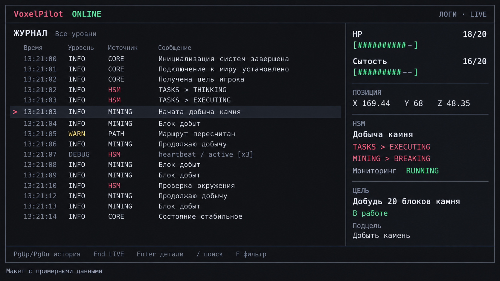

# Макет TUI VoxelPilot

Оригинальный макет предоставлен пользователем 2 октября 2026 года и сохранён без изменений в `dashboard.png`. Данные на изображении демонстрационные.

Спецификация поведения: [GitHub Issue #20](https://github.com/kindyakov/voxel-pilot/issues/20). Макет задаёт визуальный ориентир: тёмную тему, розовый акцент, зелёные индикаторы, рамки и разделители, заголовок подключения, журнал слева и панель состояния справа. Ширина колонок и компактная раскладка адаптируются к терминалу по спецификации.

Изображение содержит идеи за пределами первой версии: группировку `[x3]`, Enter для деталей, поиск `/` и меню фильтра `F`. Их наличие на макете не расширяет согласованную функциональность. Первая версия использует `d` для DEBUG, прокрутку истории, возврат в LIVE и выход через `q`/Ctrl+C; нижняя строка должна показывать реально доступные действия. Таймер основного состояния HSM добавляется по спецификации, хотя на изображении его нет.

При реализации задач TUI открой само изображение. Сравнение выполняй на искусственной телеметрии: реальные значения, гарнитура и число видимых строк зависят от терминала.

Задачи TUI: [запуск и завершение #31](https://github.com/kindyakov/voxel-pilot/issues/31), [просмотр журнала #32](https://github.com/kindyakov/voxel-pilot/issues/32), [панель состояния #33](https://github.com/kindyakov/voxel-pilot/issues/33), [адаптивное отображение #34](https://github.com/kindyakov/voxel-pilot/issues/34).
